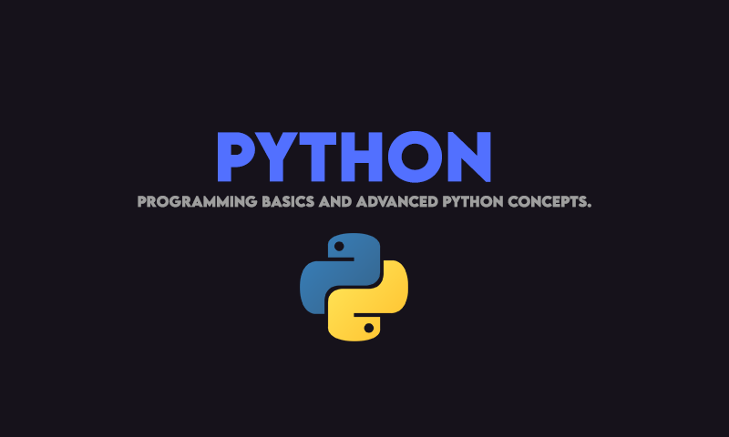

# Python Programming and scripting (Advanced and Basics).

**Following Project Includes**
- Basic Python Commands.
- Python for Machine Learning.
- Array Manupulation with Python Numpy.
- Web HTTP Python for Web-applications. 
- ioT-sensor python scripts (Soon).